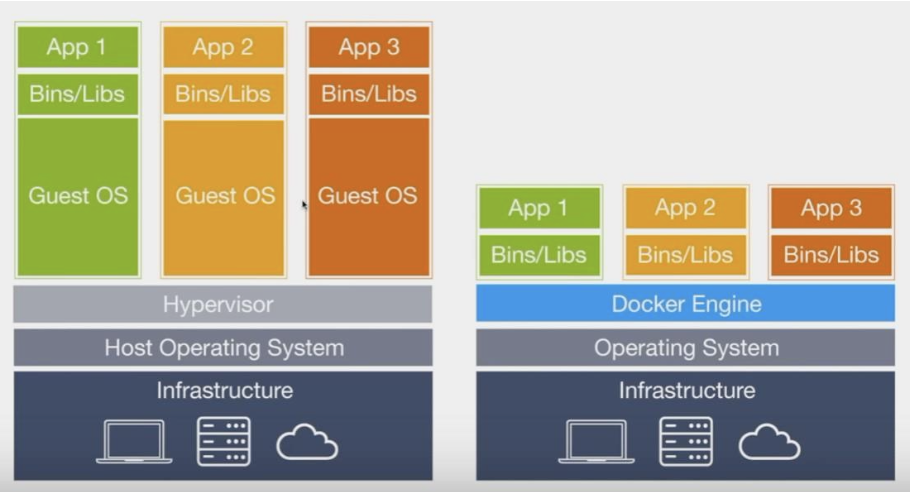
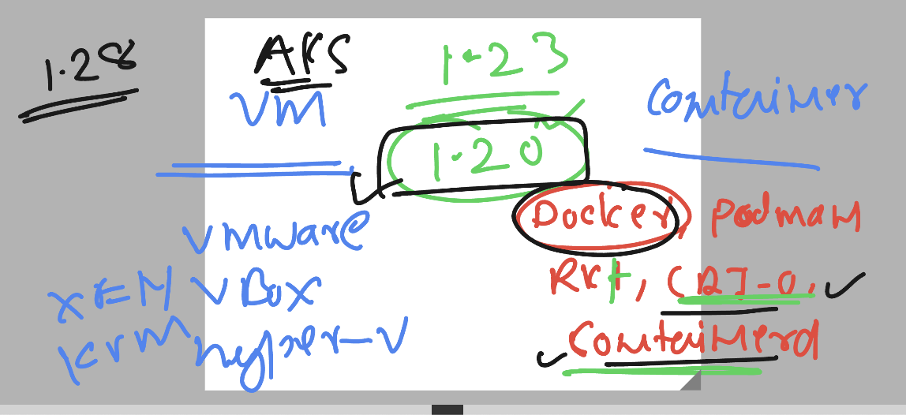
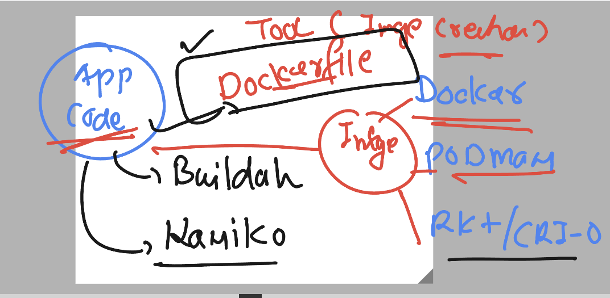
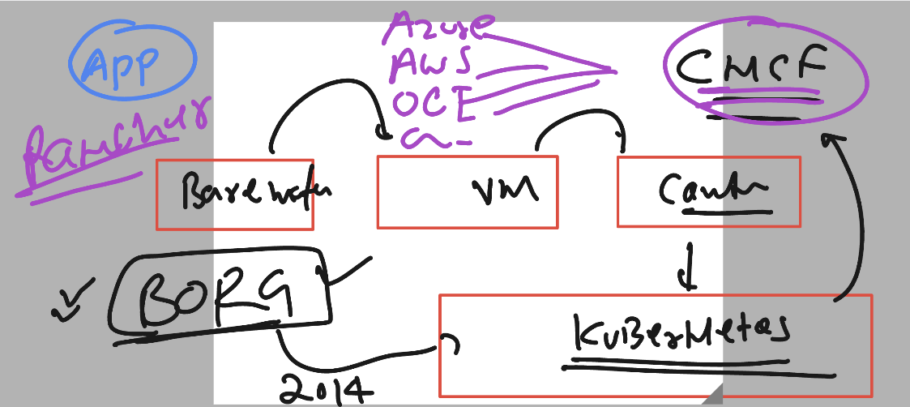

# exto360-aks

### COntainer vs vm 



### Docker got depricated by CNCF -- in k8s 1.20 onwards 



### CHECKING docker version 

```
[ashu@ip-172-31-60-143 ~]$ docker  version 
Client:
 Version:           20.10.25
 API version:       1.41
 Go version:        go1.20.10
 Git commit:        b82b9f3
 Built:             Fri Oct 13 22:46:12 2023
 OS/Arch:           linux/amd64
 Context:           default
 Experimental:      true

Server:
 Engine:
  Version:          20.10.25
  API version:      1.41 (minimum version 1.12
```

### app containerization 




### COntainerizing webui app 

### 

```
[ashu@ip-172-31-60-143 ashu-apps]$ ls
java-code  webui-app
[ashu@ip-172-31-60-143 ashu-apps]$ cd  webui-app/

[ashu@ip-172-31-60-143 webui-app]$ git clone  https://github.com/microsoft/project-html-website
Cloning into 'project-html-website'...
remote: Enumerating objects: 24, done.
remote: Counting objects: 100% (5/5), done.
remote: Compressing objects: 100% (5/5), done.
remote: Total 24 (delta 0), reused 4 (delta 0), pack-reused 19
Receiving objects: 100% (24/24), 465.86 KiB | 10.83 MiB/s, done.
[ashu@ip-172-31-60-143 webui-app]$ ls
project-html-website
```

### building docker image 

```
[ashu@ip-172-31-60-143 webui-app]$ ls
Dockerfile  project-html-website
[ashu@ip-172-31-60-143 webui-app]$ docker  build   -t   ashuwebui:v1  . 
Sending build context to Docker daemon  1.375MB
Step 1/4 : FROM nginx
latest: Pulling from library/nginx
a378f10b3218: Pull complete 
4dfff0708538: Pull complete 
2135e49ace4b: Pull complete 
c843f6b280ce: Pull complete 
6f35ab6f1400: Pull complete 
6c538b49fa4a: Pull complete 
d57731fb9008: Pull complete 
Digest: sha256:b4af4f8b6470febf45dc10f564551af682a802eda1743055a7dfc8332dffa595
Status: Downloaded newer image for nginx:latest
 ---> bc649bab30d1
Step 2/4 : LABEL name="ashutoshh"
 ---> Running in 715deea0a07e
Removing intermediate container 715deea0a07e
 ---> ddc2def3c4d9
Step 3/4 : LABEL email="ashutoshh@linux.com"
 ---> Running in 7c59453d21ce
Removing intermediate container 7c59453d21ce
 ---> 04b7bf1adc6b
Step 4/4 : COPY project-html-website  /usr/share/nginx/html/
 ---> 5b572a2bb2e1
Successfully built 5b572a2bb2e1
Successfully tagged ashuwebui:v1
```
### verify image build 

```
ashu@ip-172-31-60-143 webui-app]$ docker  images
REPOSITORY     TAG       IMAGE ID       CREATED              SIZE
<none>         <none>    61ba7126c62b   38 seconds ago       187MB
siva           v1        084efdd163bd   46 seconds ago       188MB
praveenwebui   v1        02299a9fffd8   48 seconds ago       188MB
amitwebui      v1        6bca9615d242   About a minute ago   188MB
anandwebui     v1        35ced1e017f6   2 minutes ago        188MB
rahulwebui     v1        1dfdb17a2f82   2 minutes ago        188MB
docapp         v1        7d767124a4bd   2 minutes ago        188MB
hariwebui      v1        aec7995ea01b   2 minutes ago        188MB
ashuwebui      v1        5b572a2bb2e1   2 minutes ago        188MB
nginx          latest    bc649bab30d1   12 days ago          187MB
[ashu@ip-172-31-60-143 webui-app]$ 
```

### Creating container from image 

```
[ashu@ip-172-31-60-143 webui-app]$ docker  run  --name ashuc1 -d  ashuwebui:v1  
f6539b1bc71e0efa4de09f061779827d598af66fb40c0f1363eb3a74b4bf4fa2

=====> list running containers

[ashu@ip-172-31-60-143 webui-app]$ docker  ps
CONTAINER ID   IMAGE           COMMAND                  CREATED          STATUS          PORTS     NAMES
d16ed5f9c3a6   docapp:v1       "/docker-entrypoint.…"   23 seconds ago   Up 22 seconds   80/tcp    meghac1
2188ad6017d3   rahulwebui:v1   "/docker-entrypoint.…"   25 seconds ago   Up 24 seconds   80/tcp    rahulcontainer1
a2f677f115a8   kovardhan:v1    "/docker-entrypoint.…"   26 seconds ago   Up 26 seconds   80/tcp    kovardhan
f6539b1bc71e   ashuwebui:v1    "/docker-entrypoint.…"   30 seconds ago   Up 29 seconds   80/tcp    ashuc1
```

## Docker networking -- 

### removing container 

```
[ashu@ip-172-31-60-143 webui-app]$ docker  stop ashuc1
ashuc1
[ashu@ip-172-31-60-143 webui-app]$ docker  rm ashuc1
ashuc1
```

### doing port forwarding 

```
 docker  run  --name ashuc1 -d  -p  1234:80      ashuwebui:v1 
```

## Introduction to kubernetres 



