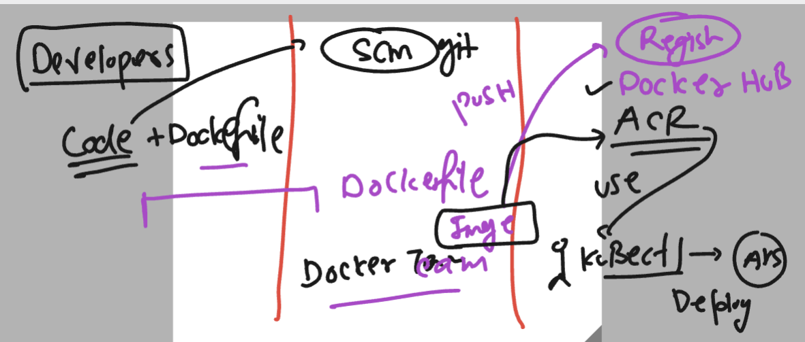
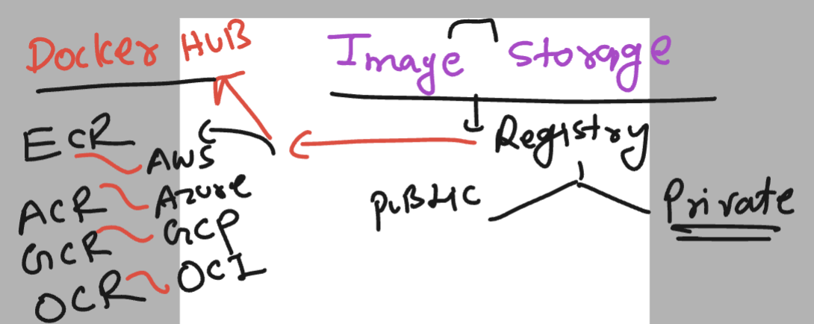
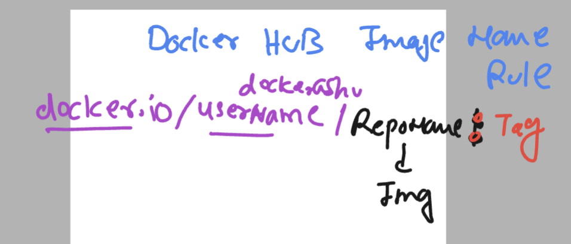
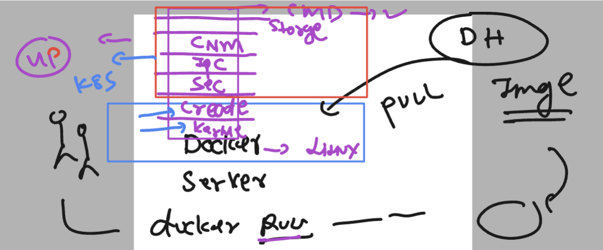
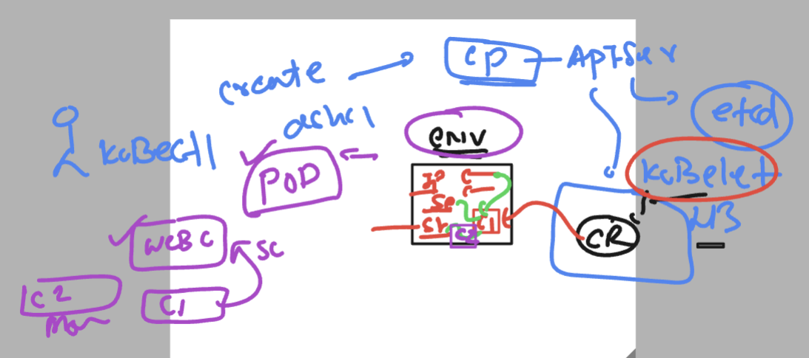
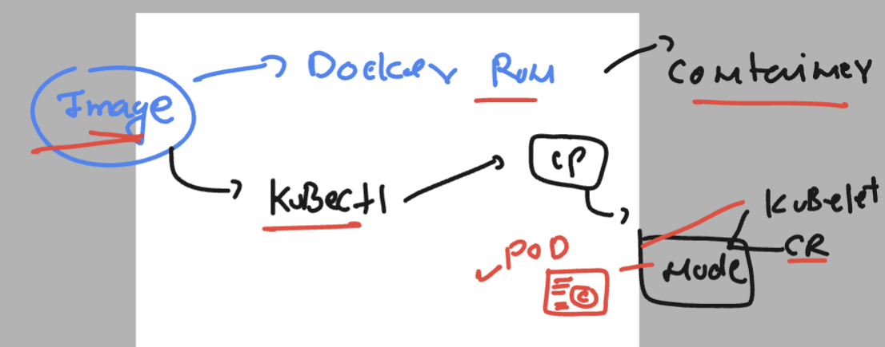
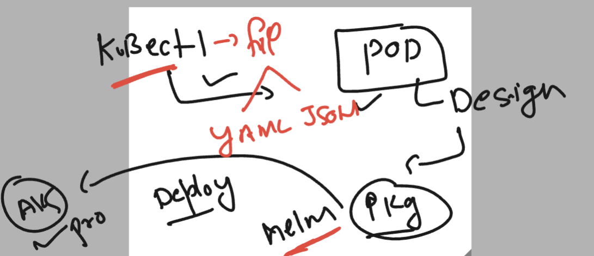

# exto360-aks

### app containerization and deployment process workflow 



### sample python script containeriztion 

### ashu.py 

```
import time

while True:
    print("Hello all , welcome to python..!!")
    time.sleep(3)
    print("Welcome to Exto..")
    time.sleep(2)
    print("Welcome to Containers ..!!")
    print("______________________")
    time.sleep(3)
```

### Dockerfile

```
FROM python
# we are refering official python image from Docker hub 
RUN mkdir  /mycode 
COPY ashu.py  /mycode/
CMD python  /mycode/ashu.py 
# whosoever gonna use my image so this will automatically run 
# python code 

```

### building image 

```
[ashu@ip-172-31-60-143 ashu-apps]$ cd  ashu-python/
[ashu@ip-172-31-60-143 ashu-python]$ 
[ashu@ip-172-31-60-143 ashu-python]$ docker  build  -t  ashupython:v1  . 
Sending build context to Docker daemon  3.072kB
Step 1/4 : FROM python
 ---> 17e65561fd2c
Step 2/4 : RUN mkdir  /mycode
 ---> Running in 67e54c0646aa
Removing intermediate container 67e54c0646aa
 ---> 7e0e407ed7b1
Step 3/4 : COPY ashu.py  /mycode/
 ---> 588dca29c1e9
Step 4/4 : CMD python  /mycode/ashu.py
 ---> Running in 9a32f710b7b5
Removing intermediate container 9a32f710b7b5
 ---> c4bd1076b35d
Successfully built c4bd1076b35d
Successfully tagged ashupython:v1
```

### creating container 

```
ashu@ip-172-31-60-143 ashu-python]$ docker  run  -dit  --name ashuc11   ashupython:v1 
\9f6406ee1fe931e723bb9a344699e2325fb67f92c2c8b1f378c2c7e3bb733750
[ashu@ip-172-31-60-143 ashu-python]$ docker  ps
CONTAINER ID   IMAGE              COMMAND                  CREATED              STATUS                  PORTS     NAMES
7e671f74b1ea   sivapy:v1          "/bin/sh -c 'python …"   2 seconds ago        Up Less than a second             SivA
394de566afd3   rahulpython:v1     "/bin/sh -c 'python …"   2 seconds ago        Up Less than a second             rahulc1
af45fa6fd29d   praveenpython:v1   "/bin/sh -c 'python …"   3 seconds ago        Up 1 second                       praveenC11
9f6406ee1fe9   ashupython:v1      "/bin/sh -c 'python …"   5 seconds ago        Up 4 seconds                      ashuc11
7d5deb98ed91   kovardhan:v1       "python3"                13 seconds ago       Up 11 seconds                     kovardhanPython
8f8c03afdb6f   shilpapython:v1    "/bin/sh -c 'python …"   54 seconds ago       Up 52 seconds                     shlpaC2
31d9f635628b   meghapython:v1     "/bin/sh -c 'python …"   About a minute ago   Up About a minute                 meghacontainer2
```

### checking output 

```
[ashu@ip-172-31-60-143 ashu-python]$ docker  logs  ashuc11 
Hello all , welcome to python..!!
Welcome to Exto..
Welcome to Containers ..!!
______________________
Hello all , welcome to python..!!
Welcome to Exto..
Welcome to Containers ..!!
```

### building docker image 

```
[ashu@ip-172-31-60-143 webui-app]$ ls
Dockerfile  httpd.dockerfile  project-html-website
[ashu@ip-172-31-60-143 webui-app]$ docker  build  -t  ashuwebapp:extov1  -f  httpd.dockerfile   .  
Sending build context to Docker daemon  835.1kB
Step 1/6 : FROM oraclelinux:8.4
 ---> 97e22ab49eea
Step 2/6 : LABEL name="ashutoshh"
 ---> Running in fc3ba480961d
Removing intermediate container fc3ba480961d
 ---> b008e48c4d24
```


### creating container to test app is working or not 

```
[ashu@ip-172-31-60-143 webui-app]$ docker images  | grep ashu
ashuwebapp       extov1     2f46b8ecc1dd   27 minutes ago      493MB
ashupython       v2         b03989717f95   44 minutes ago      50.7MB
ashupython       v1         c4bd1076b35d   About an hour ago   1.02GB
ashu             httpdv1    26c5e3ea9393   About an hour ago   492MB
[ashu@ip-172-31-60-143 webui-app]$ 
[ashu@ip-172-31-60-143 webui-app]$ docker run --name ashuweb -d  -p 1199:80  ashuwebapp:extov1 
2824c89d6cd41888b3f2d5d8632c1b8789158590ac3841246707d599a844133e
[ashu@ip-172-31-60-143 webui-app]$ 
[ashu@ip-172-31-60-143 webui-app]$ docker  ps
CONTAINER ID   IMAGE               COMMAND                  CREATED          STATUS          PORTS                                   NAMES
2824c89d6cd4   ashuwebapp:extov1   "httpd -DFOREGROUND"     30 seconds ago   Up 29 seconds   0.0.0.0:1199->80/tcp, :::1199->80/tcp   ashuweb
```

## Container registry options 



### Docker hub image format



### pushing image to docker hub 

```
[ashu@ip-172-31-60-143 webui-app]$ docker  images  | grep ashu
ashuwebapp        extov1     2f46b8ecc1dd   53 minutes ago      493MB
ashupython        v2         b03989717f95   About an hour ago   50.7MB
ashupython        v1         c4bd1076b35d   About an hour ago   1.02GB
ashu              httpdv1    26c5e3ea9393   2 hours ago         492MB

======>>

[ashu@ip-172-31-60-143 webui-app]$ 
[ashu@ip-172-31-60-143 webui-app]$ 
[ashu@ip-172-31-60-143 webui-app]$ docker  tag  ashuwebapp:extov1   docker.io/dockerashu/ashuwebexto:version1  
[ashu@ip-172-31-60-143 webui-app]$ 
[ashu@ip-172-31-60-143 webui-app]$ docker  tag  2f46b8ecc1dd   docker.io/dockerashu/ashuwebexto:version1  
[ashu@ip-172-31-60-143 webui-app]$

========>>>

[ashu@ip-172-31-60-143 webui-app]$ docker  login 
Login with your Docker ID to push and pull images from Docker Hub. If you don't have a Docker ID, head over to https://hub.docker.com to create one.
Username: dockerashu
Password: 
WARNING! Your password will be stored unencrypted in /home/ashu/.docker/config.json.
Configure a credential helper to remove this warning. See
https://docs.docker.com/engine/reference/commandline/login/#credentials-store

Login Succeeded

========>>

 docker  push  docker.io/dockerashu/ashuwebexto:version1 
The push refers to repository [docker.io/dockerashu/ashuwebexto]
2710c408246a: Pushed 
fa0378cda19c: Pushed 
2d3586eacb61: Mounted from anandh2607/anandwebgaea 
version1: digest: sha256:aeb01597c5d5d9d175815df7d56a6fd3e3ec9

====>>

```

### pushing image to ACR 

```
ashu@ip-172-31-60-143 webui-app]$ docker  tag  ashuwebapp:extov1   extoaksashu.azurecr.io/ashuwebui:appv1  
[ashu@ip-172-31-60-143 webui-app]$

======>>>

[ashu@ip-172-31-60-143 webui-app]$ docker  login  extoaksashu.azurecr.io  
Username: extoaksashu
Password: 
WARNING! Your password will be stored unencrypted in /home/ashu/.docker/config.json.
Configure a credential helper to remove this warning. See
https://docs.docker.com/engine/reference/commandline/login/#credentials-store

Login Succeeded

=====>>>

[ashu@ip-172-31-60-143 webui-app]$ docker  push extoaksashu.azurecr.io/ashuwebui:appv1 
The push refers to repository [extoaksashu.azurecr.io/ashuwebui]
2710c408246a: Pushed 
fa0378cda19c: Pushed 
2d3586eacb61: Pushed 
appv1: digest: sha256:aeb01597c5d5d9d175815df7d56a6fd3e3ec91ff4b8493f1c2b5d77bd9264234 size: 952


```

### Good practise to logout accounts

```
[ashu@ip-172-31-60-143 webui-app]$ docker logout  extoaksashu.azurecr.io 
Removing login credentials for extoaksashu.azurecr.io
[ashu@ip-172-31-60-143 webui-app]$ 
[ashu@ip-172-31-60-143 webui-app]$ 
[ashu@ip-172-31-60-143 webui-app]$ 
[ashu@ip-172-31-60-143 webui-app]$ docker logout 
Removing login credentials for https://index.docker.io/v1/
```
### how container / pod is getting created



### Introduction to pod 



### more info about pod 



### Desing of pod 



## Creating YAML manifest file 

### POD 

```
apiVersion: v1 
kind: Pod 
metadata:
  name: ashupod1 # name of my pod 
spec: # all the elements which i want in my pod 
  containers: # here we write info about our containers
  - name: ashuc1 
    image: dockerashu/ashuwebexto:version1 # image from docker hub
    ports: # optional part 
    - containerPort: 80 

   
```

### send create request to control plane -- APiserver

```
[ashu@ip-172-31-60-143 k8s-res-design]$ ls
ashupod1.yaml
[ashu@ip-172-31-60-143 k8s-res-design]$ kubectl   get  pods
No resources found in default namespace.
[ashu@ip-172-31-60-143 k8s-res-design]$ kubectl   create  -f  ashupod1.yaml 
pod/ashupod1 created
[ashu@ip-172-31-60-143 k8s-res-design]$ 
```

### checking pods

```
[ashu@ip-172-31-60-143 k8s-res-design]$ kubectl  get  pods
NAME         READY   STATUS              RESTARTS   AGE
amitpod1     1/1     Running             0          10m
anandpod1    0/1     ContainerCreating   0          11s
arvindpod1   1/1     Running             0          2m1s
ashupod1     1/1     Running             0          10m
kopod1       1/1     Running             0          35s
meghapod1    1/1     Running             0          3m51s
praveen      1/1     Running             0          2m22s
rahulpod1    1/1     Running             0          10m
shalpod      1/1     Running             0          6m53s
shilpapod1   1/1     Running             0          7m19s
sivapod1     1/1     Running             0          10m
```

### checking pod got scheduled in which node 

```
[ashu@ip-172-31-60-143 k8s-res-design]$ kubectl   get  pod  ashupod1  -o wide
NAME       READY   STATUS    RESTARTS   AGE   IP           NODE                                NOMINATED NODE   READINESS GATES
ashupod1   1/1     Running   0          12m   10.244.1.2   aks-agentpool-39082632-vmss000003   <none>           <none>
[ashu@ip-172-31-60-143 k8s-res-design]$ 
[ashu@ip-172-31-60-143 k8s-res-design]$ 
[ashu@ip-172-31-60-143 k8s-res-design]$ 
[ashu@ip-172-31-60-143 k8s-res-design]$ kubectl   get node
NAME                                STATUS   ROLES   AGE     VERSION
aks-agentpool-39082632-vmss000002   Ready    agent   5h47m   v1.26.6
aks-agentpool-39082632-vmss000003   Ready    agent   5h47m   v1.26.6
[ashu@ip-172-31-60-143 k8s-res-design]$ 
```

### all pods

```
[ashu@ip-172-31-60-143 k8s-res-design]$ kubectl   get  pod  -o wide
NAME         READY   STATUS    RESTARTS   AGE     IP            NODE                                NOMINATED NODE   READINESS GATES
amitpod1     1/1     Running   0          14m     10.244.1.5    aks-agentpool-39082632-vmss000003   <none>           <none>
anandpod1    1/1     Running   0          3m37s   10.244.1.10   aks-agentpool-39082632-vmss000003   <none>           <none>
arvindpod1   1/1     Running   0          5m27s   10.244.1.9    aks-agentpool-39082632-vmss000003   <none>           <none>
ashupod1     1/1     Running   0          14m     10.244.1.2    aks-agentpool-39082632-vmss000003   <none>           <none>
kopod1       1/1     Running   0          4m1s    10.244.0.11   aks-agentpool-39082632-vmss000002   <none>           <none>
meghapod1    1/1     Running   0          7m17s   10.244.1.8    aks-agentpool-39082632-vmss000003   <none>           <none>
praveen      1/1     Running   0          5m48s   10.244.0.10   aks-agentpool-39082632-vmss000002   <none>           <none>
rahulpod1    1/1     Running   0          14m     10.244.1.3    aks-agentpool-39082632-vmss000003   <none>           <none>
shalpod      1/1     Running   0          10m     10.244.1.7    aks-agentpool-39082632-vmss000003   <none>           <none>
shilpapod1   1/1     Running   0          10m     10.244.1.6    aks-agentpool-39082632-vmss000003   <none>           <none>
sivapod1     1/1     Running   0          14m     10.244.1.4    aks-agentpool-39082632-vmss000003   <none>           <none>
```

### checking logs of pod container 

```
kubectl  logs ashupod1 
AH00558: httpd: Could not reliably determine the server's fully qualified domain name, using 10.244.1.2. Set the 'ServerName' directive globally to suppress this message
```

### accessing container inside pod 

```
[ashu@ip-172-31-60-143 k8s-res-design]$ kubectl  exec  -it  ashupod1 -- bash 
[root@ashupod1 /]# 
[root@ashupod1 /]# 
[root@ashupod1 /]# 
[root@ashupod1 /]# cd  /var/www/html/
[root@ashupod1 html]# ls
css  fonts  img  index.html
[root@ashupod1 html]# exit
exit
```

### using describe for troubleshooting 

```
[ashu@ip-172-31-60-143 ~]$ kubectl   describe  pod  ashupod2
Name:             ashupod2
Namespace:        default
Priority:         0
Service Account:  default
Node:             aks-agentpool-39082632-vmss000003/10.224.0.4
Start Time:       Wed, 25 Oct 2023 10:05:09 +0000
Labels:           <none>
Annotations:      cni.projectcalico.org/containerID: d3ab652efaac3f9690ba60afb5caaff7e5c7bbbd5b626813491b46d55942917d
                  cni.projectcalico.org/podIP: 10.244.1.11/32
                  cni.projectcalico.org/podIPs: 10.244.1.11/32
Status:           Pending
IP:               10.244.1.11
IPs:
  IP:  10.244.1.11
Containers:
  ashuc1:
    Container ID:   
    Image:          extoaksashu.azurecr.io/ashuwebui:appv1
    Image ID:       
    Port:           80/TCP
    Host Port:      0/TCP

```

### Multi container pod 

```
apiVersion: v1 
kind: Pod 
metadata:
  name: ashupod1 # name of my pod 
spec: # all the elements which i want in my pod 
  containers: # here we write info about our containers
  - name: ashuc2 
    image: alpine 
    command: ['sleep','1200'] # to modify existing cmd/ENTRYPOINT by dockerfile 
  - name: ashuc1 
    image: dockerashu/ashuwebexto:version1 # image from docker hub
    ports: # optional part 
    - containerPort: 80 

   
```


### replace it 

```
kubectl  replace -f  ashupod1.yaml   --force
pod "ashupod1" deleted
pod/ashupod1 replaced
```

### checking it

```
[ashu@ip-172-31-60-143 k8s-res-design]$ kubectl  get  pods
NAME         READY   STATUS        RESTARTS   AGE
amitpod1     2/2     Running       0          24s
anandpod1    1/1     Running       0          26m
arvindpod1   1/1     Running       0          28m
ashupod1     2/2     Running       0          45s
kopod1       1/1     Running       0          26m
meghapod1    1/1     Running       0          30m
praveen      1/1     Running       0          28m
rahulpod1    2/2     Running       0          30s
shalpod      1/1     Running       0          33m
shilpapod1   1/1     Terminating   0          33m
sivapod1     1/1     Running       0          37m
```

### generating yaml/json using kubectl 

```
[ashu@ip-172-31-60-143 ~]$ kubectl   run  ashupodx1 --image=dockerashu/ashuwebexto:version1 --port 80 --dry-run=client -o yaml
apiVersion: v1
kind: Pod
metadata:
  creationTimestamp: null
  labels:
    run: ashupodx1
  name: ashupodx1
spec:
  containers:
  - image: dockerashu/ashuwebexto:version1
    name: ashupodx1
    ports:
    - containerPort: 80
    resources: {}
  dnsPolicy: ClusterFirst
  restartPolicy: Always
status: {}
[ashu@ip-172-31-60-143 ~]$ kubectl   run  ashupodx1 --image=dockerashu/ashuwebexto:version1 --port 80 --dry-run=client -o json 
{
    "kind": "Pod",
    "apiVersion": "v1",
    "metadata": {
        "name": "ashupodx1",
        "creationTimestamp": null,
        "labels": {
            "run": "ashupodx1"
        }
    },
    "spec": {
        "containers": [
            {
                "name": "ashupodx1",
                "image": "dockerashu/ashuwebexto:version1",
                "ports": [
                    {
                        "containerPort": 80
                    }
                ],
                "resources": {}
            }
        ],
        "restartPolicy": "Always",
        "dnsPolicy": "ClusterFirst"
    },
    "status": {}
}

```

### redirect it into a file

```
kubectl   run  ashupodx1 --image=dockerashu/ashuwebexto:version1 --port 80 --dry-run=client -o yaml      >autopod.yaml
```

### deleting a pod 

```
[ashu@ip-172-31-60-143 k8s-res-design]$ kubectl  delete pod ashupod1
pod "ashupod1" deleted
[ashu@ip-172-31-60-143 k8s-res-design]$ kubectl  delete -f ashupod1.yaml  

```

