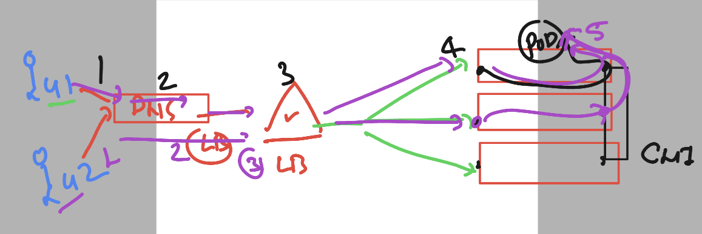
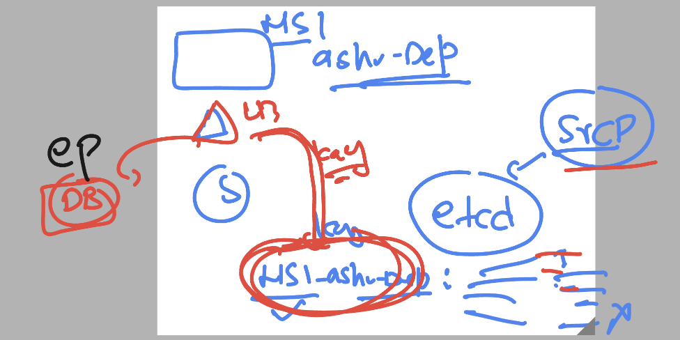
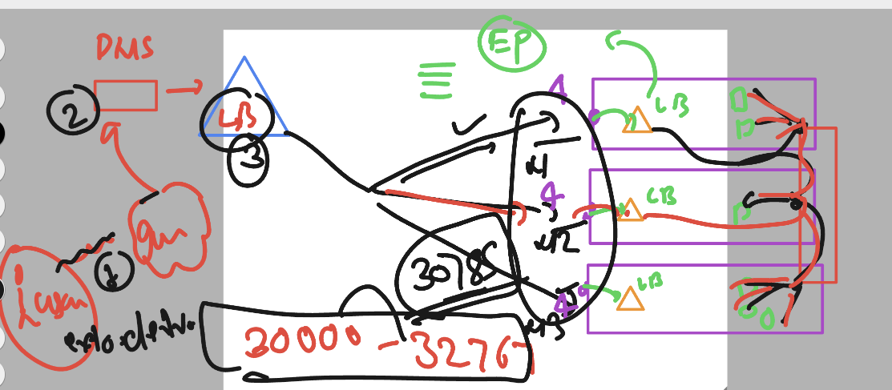
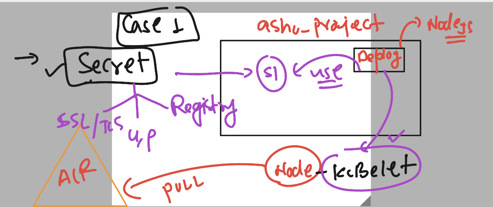
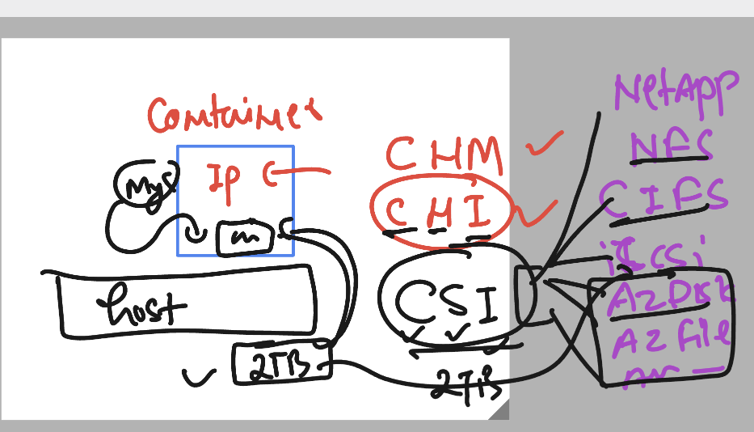

# exto360-aks

### checking cluster details 

```
[ashu@ip-172-31-60-143 ashu-apps]$ kubectl  get no
NAME                                STATUS   ROLES   AGE   VERSION
aks-agentpool-39082632-vmss000004   Ready    agent   12m   v1.26.6
aks-agentpool-39082632-vmss000005   Ready    agent   11m   v1.26.6
[ashu@ip-172-31-60-143 ashu-apps]$ 
[ashu@ip-172-31-60-143 ashu-apps]$ 
[ashu@ip-172-31-60-143 ashu-apps]$ kubectl  get  ns
NAME              STATUS   AGE
amit-projec       Active   16h
anand-project     Active   16h
arvind-project    Active   16h
ashu-project      Active   16h
calico-system     Active   41h
default           Active   41h
ko-project        Active   16h
kube-node-lease   Active   41h
kube-public       Active   41h
kube-system       Active   41h
megha-project     Active   16h
praveen-peoject   Active   16h
rahul-project     Active   16h
shal              Active   16h
shilpa-project    Active   16h
siva              Active   16h
tigera-operator   Active   41h
```

### checking current namespace

```
[ashu@ip-172-31-60-143 ashu-apps]$ kubectl config get-contexts 
CURRENT   NAME              CLUSTER           AUTHINFO                                          NAMESPACE
*         ext-360-cluster   ext-360-cluster   clusterUser_container-expertise_ext-360-cluster   ashu-project
[ashu@ip-172-31-60-143 ashu-apps]$ 
[ashu@ip-172-31-60-143 ashu-apps]$ 
```

### checking config view 

```
kubectl  config  view 
apiVersion: v1
clusters:
- cluster:
    certificate-authority-data: DATA+OMITTED
    server: https://ext-360-cluster-dns-ztmjkln9.hcp.centralindia.azmk8s.io:443
  name: ext-360-cluster
contexts:
- context:
    cluster: ext-360-cluster
    namespace: ashu-project
    user: clusterUser_container-expertise_ext-360-cluster
  name: ext-360-cluster
current-context: ext-360-cluster
kind: Config
preferences: {}
users:
- name: clusterUser_container-expertise_ext-360-cluster
  user:
    client-certificate-data: DATA+OMITTED
    client-key-data: DATA+OMITTED
    token: REDACTED
```

### pods can communicate to each other 

```
 kubectl  run -it --rm  --image=alpine  --command sh 


If you don't see a command prompt, try pressing enter.

/ # 
/ # 
/ # ping  10.244.0.5
PING 10.244.0.5 (10.244.0.5): 56 data bytes
64 bytes from 10.244.0.5: seq=0 ttl=63 time=0.214 ms
64 bytes from 10.244.0.5: seq=1 ttl=63 time=0.090 ms
64 bytes from 10.244.0.5: seq=2 ttl=63 time=0.112 ms
^C
```

### Creating deployment 

```
[ashu@ip-172-31-60-143 ashu-apps]$ ls
apache-server  ashu-python  java-code  k8s-res-design  node-app  webui-app
[ashu@ip-172-31-60-143 ashu-apps]$ cd  k8s-res-design/
[ashu@ip-172-31-60-143 k8s-res-design]$ ls
ashupod1.yaml  ashupod2.yaml  autopod.yaml  deploy1.yaml  sts.yaml
[ashu@ip-172-31-60-143 k8s-res-design]$ kubectl   create -f deploy1.yaml 
deployment.apps/ashu-deploy1 created
[ashu@ip-172-31-60-143 k8s-res-design]$ kubectl   get  deploy
NAME           READY   UP-TO-DATE   AVAILABLE   AGE
ashu-deploy1   0/1     1            0           4s
[ashu@ip-172-31-60-143 k8s-res-design]$ kubectl  get  po 
NAME                            READY   STATUS              RESTARTS   AGE
ashu-deploy1-5ccff9465f-s8s6z   0/1     ContainerCreating   0          8s
pod1                            1/1     Running             0          8m29s
[ashu@ip-172-31-60-143 k8s-res-design]$ kubectl  delete pod pod1 
pod "pod1" deleted
[ashu@ip-172-31-60-143 k8s-res-design]$ 
```

### scaling pod to 2 



### scaling 

```
ashu@ip-172-31-60-143 k8s-res-design]$ kubectl  get  no
NAME                                STATUS   ROLES   AGE   VERSION
aks-agentpool-39082632-vmss000004   Ready    agent   77m   v1.26.6
aks-agentpool-39082632-vmss000005   Ready    agent   77m   v1.26.6
aks-agentpool-39082632-vmss000006   Ready    agent   41m   v1.26.6
[ashu@ip-172-31-60-143 k8s-res-design]$ 
[ashu@ip-172-31-60-143 k8s-res-design]$ kubectl  get  deploy
NAME           READY   UP-TO-DATE   AVAILABLE   AGE
ashu-deploy1   1/1     1            1           29m
[ashu@ip-172-31-60-143 k8s-res-design]$ kubectl  scale  deployment ashu-deploy1  --replicas 2
deployment.apps/ashu-deploy1 scaled
[ashu@ip-172-31-60-143 k8s-res-design]$ kubectl  get  deploy
NAME           READY   UP-TO-DATE   AVAILABLE   AGE
ashu-deploy1   1/2     2            1           30m
[ashu@ip-172-31-60-143 k8s-res-design]$ kubectl get po -o wide
NAME                            READY   STATUS              RESTARTS   AGE   IP            NODE                                NOMINATED NODE   READINESS GATES
ashu-deploy1-5ccff9465f-lw7c5   0/1     ContainerCreating   0          11s   <none>        aks-agentpool-39082632-vmss000006   <none>           <none>
ashu-deploy1-5ccff9465f-s8s6z   1/1     Running             0          30m   10.244.0.10   aks-agentpool-39082632-vmss000004   <none>           <none>
[ashu@ip-172-31-60-143 k8s-res-design]$ 
```

### service discovery in k8s 



### introduction to service resource under apiversion v1 

```
[ashu@ip-172-31-60-143 k8s-res-design]$ kubectl  create service
Create a service using a specified subcommand.

Aliases:
service, svc

Available Commands:
  clusterip      Create a ClusterIP service
  externalname   Create an ExternalName service
  loadbalancer   Create a LoadBalancer service
  nodeport       Create a NodePort service
```

### creating internal LB using clusterip type service

```
[ashu@ip-172-31-60-143 k8s-res-design]$ kubectl  create service   clusterip  ashu-web-lb  --tcp  1234:80  --dry-run=client -o yaml 
apiVersion: v1
kind: Service
metadata:
  creationTimestamp: null
  labels:
    app: ashu-web-lb
  name: ashu-web-lb
spec:
  ports:
  - name: 1234-80
    port: 1234
    protocol: TCP
    targetPort: 80
  selector:
    app: ashu-web-lb
  type: ClusterIP
status:
  loadBalancer: {}
```

### creating it 

```
kubectl  create service   clusterip  ashu-web-lb  --tcp  1234:80  --dry-run=client -o yaml >web_lb.yaml
[ashu@ip-172-31-60-143 k8s-res-design]$ 
[ashu@ip-172-31-60-143 k8s-res-design]$ kubectl  create -f web_lb.yaml 
service/ashu-web-lb created
[ashu@ip-172-31-60-143 k8s-res-design]$ 
[ashu@ip-172-31-60-143 k8s-res-design]$ kubectl  get service 
NAME          TYPE        CLUSTER-IP     EXTERNAL-IP   PORT(S)    AGE
ashu-web-lb   ClusterIP   10.0.240.221   <none>        1234/TCP   5s
[ashu@ip-172-31-60-143 k8s-res-design]$ 

```

### easitest method

```
kubectl   create  -f deploy1.yaml 
deployment.apps/ashu-deploy1 created
[ashu@ip-172-31-60-143 k8s-res-design]$ kubectl  get  deploy
NAME           READY   UP-TO-DATE   AVAILABLE   AGE
ashu-deploy1   1/1     1            1           7s
[ashu@ip-172-31-60-143 k8s-res-design]$ kubectl  get  po 
NAME                            READY   STATUS    RESTARTS   AGE
ashu-deploy1-5ccff9465f-std9d   1/1     Running   0          26s
```

### using expose to create service 

```
[ashu@ip-172-31-60-143 k8s-res-design]$ kubectl  get  deploy
NAME           READY   UP-TO-DATE   AVAILABLE   AGE
ashu-deploy1   1/1     1            1           2m46s
[ashu@ip-172-31-60-143 k8s-res-design]$ 
[ashu@ip-172-31-60-143 k8s-res-design]$ kubectl  expose  deployment  ashu-deploy1  --type ClusterIP --port 80 --name ashu-web-lb  --dry-run=client  -o yaml  >auto_web_lb.yaml 
[ashu@ip-172-31-60-143 k8s-res-design]$ kubectl  create -f auto_web_lb.yaml 
service/ashu-web-lb created
[ashu@ip-172-31-60-143 k8s-res-design]$ kubectl  get  service
NAME          TYPE        CLUSTER-IP     EXTERNAL-IP   PORT(S)   AGE
ashu-web-lb   ClusterIP   10.0.242.126   <none>        80/TCP    6s
[ashu@ip-172-31-60-143 k8s-res-design]$ kubectl  get  ep 
NAME          ENDPOINTS        AGE
ashu-web-lb   10.244.2.32:80   12s
[ashu@ip-172-31-60-143 k8s-res-design]$ 
```
### Creating internal and external LB using Loadbalancer service type

```
[ashu@ip-172-31-60-143 k8s-res-design]$ kubectl  get  svc
NAME          TYPE        CLUSTER-IP     EXTERNAL-IP   PORT(S)   AGE
ashu-web-lb   ClusterIP   10.0.242.126   <none>        80/TCP    19m
[ashu@ip-172-31-60-143 k8s-res-design]$ kubectl   delete svc  ashu-web-lb 
service "ashu-web-lb" deleted
[ashu@ip-172-31-60-143 k8s-res-design]$ 


```

### creating lb
```
[ashu@ip-172-31-60-143 k8s-res-design]$ kubectl  get  deploy
NAME           READY   UP-TO-DATE   AVAILABLE   AGE
ashu-deploy1   1/1     1            1           25m
[ashu@ip-172-31-60-143 k8s-res-design]$ kubectl  expose deployment ashu-deploy1 --type LoadBalancer --port 80 --name ashu-lb-inext --dry-run=client  -o yaml >int_ext_lb.yaml 
[ashu@ip-172-31-60-143 k8s-res-design]$ kubectl  create -f int_ext_lb.yaml 
service/ashu-lb-inext created
[ashu@ip-172-31-60-143 k8s-res-design]$ kubectl  get  svc
NAME            TYPE           CLUSTER-IP    EXTERNAL-IP   PORT(S)        AGE
ashu-lb-inext   LoadBalancer   10.0.190.49   <pending>     80:30785/TCP   4s
[ashu@ip-172-31-60-143 k8s-res-design]$

```

### service in overall way 




## deploying node and mongo app 

```
 mkdir my-node-mongo-app
[ashu@ip-172-31-60-143 ashu-apps]$ cd my-node-mongo-app/
[ashu@ip-172-31-60-143 my-node-mongo-app]$ ls
[ashu@ip-172-31-60-143 my-node-mongo-app]$ 

```

### Creating node-js-app as deployment controller 

```
kubectl   create  deploy ashu-node  --image=extoaksashu.azurecr.io/node-app:v1   --port 3000 --dry-run=client -o yaml  >node_deploy.yaml 
```

### having yaml

```
apiVersion: apps/v1
kind: Deployment
metadata:
  creationTimestamp: null
  labels:
    app: ashu-node
  name: ashu-node # name of deployment 
spec:
  replicas: 1 # number of pod we want 
  selector:
    matchLabels:
      app: ashu-node
  strategy: {}
  template: # to create pods 
    metadata:
      creationTimestamp: null
      labels: # label of all the pods 
        app: ashu-node
    spec:
      containers:
      - image: extoaksashu.azurecr.io/node-app:v1 # from ACR 
        name: node-app
        ports:
        - containerPort: 3000
        resources: {}
status: {}

```

### we are unable to pull image so checking events

```
[ashu@ip-172-31-60-143 my-node-mongo-app]$ kubectl  get events 
LAST SEEN   TYPE      REASON              OBJECT                               MESSAGE
20m         Normal    Killing             pod/ashu-deploy1-5ccff9465f-std9d    Stopping container ashuwebexto
20m         Normal    Scheduled           pod/ashu-deploy1-5ccff9465f-tc89f    Successfully assigned ashu-project/ashu-deploy1-5ccff9465f-tc89f to aks-agentpool-39082632-vmss000006
20m         Normal    Pulled              pod/ashu-deploy1-5ccff9465f-tc89f    Container image "dockerashu/ashuwebexto:version1" already present on machine
20m         Normal    Created             pod/ashu-deploy1-5ccff9465f-tc89f    Created container ashuwebexto
20m         Normal    Started             pod/ashu-deploy1-5ccff9465f-tc89f    Started container ashuwebexto
20m         Normal    Killing             pod/ashu-deploy1-5ccff9465f-tc89f    Stopping container ashuwebexto
20m         Normal    SuccessfulCreate    replicaset/ashu-deploy1-5ccff9465f   Created pod: ashu-deploy1-5ccff9465f-tc89f
3m13s       Normal    Scheduled           pod/ashu-node-7f4b64f677-bwlxw       Successfully assigned ashu-project/ashu-node-7f4b64f677-bwlxw to aks-agentpool-39082632-vmss000006
103s        Normal    Pulling             pod/ashu-node-7f4b64f677-bwlxw       Pulling image "extoaksashu.azurecr.io/node-app:v1"
103s        Warning   Failed              pod/ashu-node-7f4b64f677-bwlxw       Failed to pull image "extoaksashu.azurecr.io/node-app:v1": rpc error: code = Unknown desc = failed to pull and unpack image "extoaksashu.azurecr.io/node-app:v1": failed to resolve reference "extoaksashu.azurecr.io/node-app:v1": failed to authorize: failed to fetch anonymous token: unexpected status from GET request to https://extoaksashu.azurecr.io/oauth2/token?scope=repository%3Anode-app%3Apull&service=extoaksashu.azurecr.io: 401 Unauthorized
103s        Warning   Failed              pod/ashu-node-7f4b64f677-bwlxw       Error: ErrImagePull
77s         Normal    BackOff             pod/ashu-node-7f4b64f677-bwlxw       Back-off pulling image "extoaksashu.azurecr.io/node-app:v1"
88s         Warning   Failed              pod/ashu-node-7f4b64f677-bwlxw       Error: ImagePullBackOff
3m13s       Normal    SuccessfulCreate    replicaset/ashu-node-7f4b64f677      Created pod: ashu-node-7f4b64f677-bwlxw
3m13s       Normal    ScalingReplicaSet   deployment/ashu-node                 Scaled up replica set ashu-node-7f4b64f677 to 1
```

### to pull any private image from any registry we have to share cred to kubelet by controllers/ pod 



### Creating docker secret 

```
kubectl  create secret  docker-registry  ashu-reg-cred --docker-server extoaksashu.azurecr.io        --docker-username   extoaksashu   --docker-password="NXxqg6jRCev89b"  --dry-run=client -o yaml >az_secret.yaml

===========>>
ashu@ip-172-31-60-143 my-node-mongo-app]$ kubectl  create  -f  az_secret.yaml 
secret/ashu-reg-cred created
[ashu@ip-172-31-60-143 my-node-mongo-app]$ kubectl get secrets
NAME            TYPE                             DATA   AGE
ashu-reg-cred   kubernetes.io/dockerconfigjson   1      6s
[ashu@ip-172-31-60-143 my-node-mongo-app]$ 

```

### updating deployment to use secret

```
apiVersion: apps/v1
kind: Deployment
metadata:
  creationTimestamp: null
  labels:
    app: ashu-node
  name: ashu-node # name of deployment 
spec:
  replicas: 1 # number of pod we want 
  selector:
    matchLabels:
      app: ashu-node
  strategy: {}
  template: # to create pods 
    metadata:
      creationTimestamp: null
      labels: # label of all the pods 
        app: ashu-node
    spec:
      imagePullSecrets: # calling secret 
      - name: ashu-reg-cred # name of secret 
      containers:
      - image: extoaksashu.azurecr.io/node-app:v1 # from ACR 
        name: node-app
        ports:
        - containerPort: 3000
        resources: {}
status: {}

```

### apply changes

```
kubectl  apply -f node_deploy.yaml 
deployment.apps/ashu-node configured
[ashu@ip-172-31-60-143 my-node-mongo-app]$ 
[ashu@ip-172-31-60-143 my-node-mongo-app]$ kubectl  get po
NAME                        READY   STATUS    RESTARTS   AGE
ashu-node-6bdcc5668-5pntk   1/1     Running   0          2m
```

### Creating LB type service -- if we don;t have Ingress controller 

```
[ashu@ip-172-31-60-143 my-node-mongo-app]$ kubectl  get  deploy
NAME        READY   UP-TO-DATE   AVAILABLE   AGE
ashu-node   1/1     1            1           29m
[ashu@ip-172-31-60-143 my-node-mongo-app]$ kubectl   expose deployment ashu-node --type LoadBalancer --port 80  --target-port 3000 --name ashu-node-lb --dry-run=client -o yaml >nodeapp_lb.yaml 
[ashu@ip-172-31-60-143 my-node-mongo-app]$ kubectl  create -f nodeapp_lb.yaml 
service/ashu-node-lb created
[ashu@ip-172-31-60-143 my-node-mongo-app]$ kubectl  get  svc
NAME           TYPE           CLUSTER-IP    EXTERNAL-IP   PORT(S)        AGE
ashu-node-lb   LoadBalancer   10.0.91.224   <pending>     80:32578/TCP   5s
[ashu@ip-172-31-60-143 my-node-mongo-app]$ kubectl  get  ep
NAME           ENDPOINTS          AGE
ashu-node-lb   10.244.2.69:3000   9s
[ashu@ip-172-31-60-143 my-node-mongo-app]$ 
```

### storage story 



### Creating mongodb deployment controller 

```
kubectl   create  deployment  ashu-mongo  --image=mongo  --port 27017  --dry-run=client -o yaml >mongo_db.yaml 
```

### Creating secret to db cred 

```
 kubectl  create  secret generic  ashu-db-cred --from-literal my-user=ashu  --from-literal my-password="Hello@Ashu123" --dry-run=client -o yaml >db_cred.yaml
```

### deploy it 

```
kubectl  create -f db_cred.yaml 
secret/ashu-db-cred created
[ashu@ip-172-31-60-143 my-node-mongo-app]$ kubectl  get  secret
NAME            TYPE                             DATA   AGE
ashu-db-cred    Opaque                           2      5s
ashu-reg-cred   kubernetes.io/dockerconfigjson   1      66m
[ashu@ip-172-31-60-143 my-node-mongo-app]$ 
```

### updating mongodb deployment file

```
apiVersion: apps/v1
kind: Deployment
metadata:
  creationTimestamp: null
  labels:
    app: ashu-mongo
  name: ashu-mongo
spec:
  replicas: 1
  selector:
    matchLabels:
      app: ashu-mongo
  strategy: {}
  template:
    metadata:
      creationTimestamp: null
      labels:
        app: ashu-mongo
    spec:
      containers:
      - image: mongo
        name: mongo
        ports:
        - containerPort: 27017
        env: # to create / pass ENV variable info 
        - name: MONGO_INITDB_ROOT_USERNAME
          valueFrom:  # reading from somewhere
            secretKeyRef: # from secret 
              name: ashu-db-cred # name of secret 
              key:  my-user # key which store user info 
        - name: MONGO_INITDB_ROOT_PASSWORD
          valueFrom:
            secretKeyRef:
              name: ashu-db-cred
              key: my-password 
           
        resources: {}
status: {}

```


