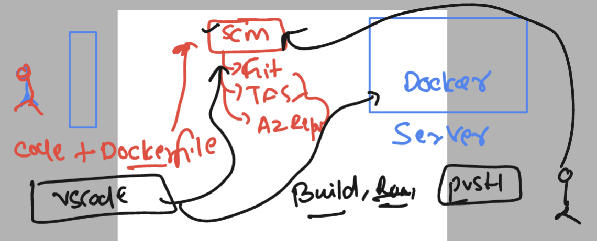
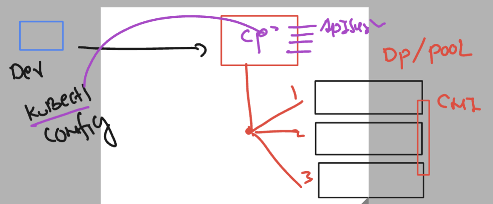
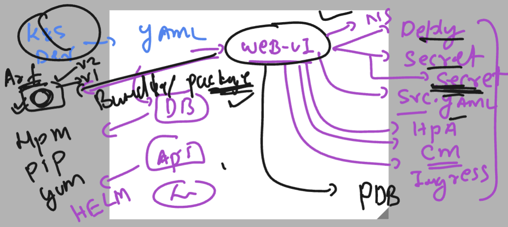
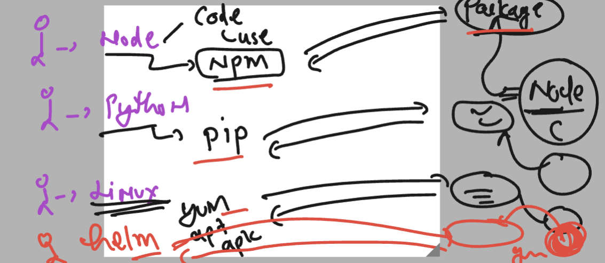

# exto360-aks

### app containerization with git and docker server



### k8s arch rev



### checking cluster info

```
kubectl  cluster-info 
Kubernetes control plane is running at https://ext-360-cluster-dns-ztmjkln9.hcp.centralindia.azmk8s.io:443
CoreDNS is running at https://ext-360-cluster-dns-ztmjkln9.hcp.centralindia.azmk8s.io:443/api/v1/namespaces/kube-system/services/kube-dns:dns/proxy
Metrics-server is running at https://ext-360-cluster-dns-ztmjkln9.hcp.centralindia.azmk8s.io:443/api/v1/namespaces/kube-system/services/https:metrics-server:/proxy

```

### deleteing all namespace data

```
kubectl  delete all --all
pod "ashu-mongo-7b968fd595-gp7zt" deleted
pod "ashu-node-59f86797d6-4x6ss" deleted
pod "ashu-node-59f86797d6-9496n" deleted
pod "ashu-node-59f86797d6-9882w" deleted
pod "ashu-node-59f86797d6-kkdvn" deleted
pod "ashu-node-59f86797d6-zkhcn" deleted
service "ashu-mongo-lb" deleted
service "ashu-node-lb" deleted
deployment.apps "ashu-mongo" deleted
deployment.apps "ashu-node" deleted
horizontalpodautoscaler.autoscaling "ashu-node" deleted
```

### few commands for admin

```
 kubectl  delete all --all
  584  kubectl  get secrets
  585  kubectl  get  po 
  586  kubectl  get  po  -A
  587  kubectl  get  secret  -A
  588  kubectl  get  secret  --all-namespaces 
  589  history 
  590  kubectl  get  all -n amit-projec
  591  kubectl  get  all -n amit-project
  592  kubectl  -n  amit-project  exec -it  amit-node-87886cfc5-2796b  -- bash 
```

### deleting it 

```
kubectl  apply  -f my-node-mongo-app/
secret/ashu-reg-cred configured
secret/ashu-db-cred configured
horizontalpodautoscaler.autoscaling/ashu-node configured
deployment.apps/ashu-mongo configured
service/ashu-mongo-lb configured
deployment.apps/ashu-node configured
service/ashu-node-lb configured
[ashu@ip-172-31-60-143 ashu-apps]$ kubectl delete  -f my-node-mongo-app/
secret "ashu-reg-cred" deleted
secret "ashu-db-cred" deleted
horizontalpodautoscaler.autoscaling "ashu-node" deleted
deployment.apps "ashu-mongo" deleted
service "ashu-mongo-lb" deleted
```

### k8s yaml packaging 



### helm version 



### verify helm and kubectl in windows 

```
 history

  Id CommandLine
  -- -----------
   1 helm version
   2 kubectl version --client -o yaml
   3 kubectl  get nodes
   4 kubectl  config  get-contexts
   5 kubectl get  ns
   6 kubectl config set-context --current --namespace default


PS C:\Users\humanfirmware> kubectl  config  get-contexts
CURRENT   NAME              CLUSTER           AUTHINFO                                          NAMESPACE
*         ext-360-cluster   ext-360-cluster   clusterUser_container-expertise_ext-360-cluster   default
PS C:\Users\humanfirmware>
PS C:\Users\humanfirmware>
PS C:\Users\humanfirmware>
PS C:\Users\humanfirmware>
PS C:\Users\humanfirmware>
```


