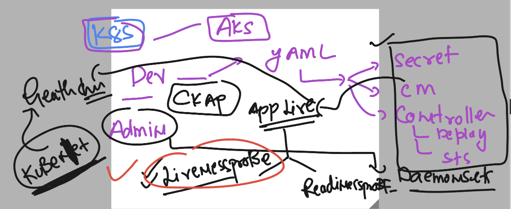
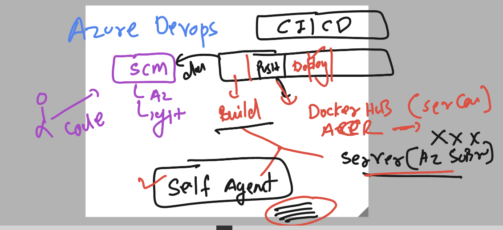

# exto360-aks

### Developers 



### Azure devops pipeline methods



### terraform info 


### Terraform version check

```
terraform -v
Terraform v1.6.2
on darwin_arm64
```

### process of using terraform 

```
terraform  init 

Initializing the backend...

Initializing provider plugins...
- Finding hashicorp/azurerm versions matching "3.0.0"...
- Installing hashicorp/azurerm v3.0.0...
- Installed hashicorp/azurerm v3.0.0 (signed by HashiCorp)

Terraform has created a lock file .terraform.lock.hcl to record the provider
selections it made above. Include this file in your version control repository
so that Terraform can guarantee to make the same selections by default when
you run "terraform init" in the future.

Terraform has been successfully initialized!

You may now begin working with Terraform. Try running "terraform plan" to see
any changes that are required for your infrastructure. All Terraform commands
should now work.

```

### planning resource -- like dry-run

```
terraform plan 

Terraform used the selected providers to generate the following execution plan. Resource actions are indicated with the following symbols:
  + create

Terraform will perform the following actions:

  # azurerm_resource_group.ashu-grp will be created
  + resource "azurerm_resource_group" "ashu-grp" {
      + id       = (known after apply)
      + location = "eastus"
      + name     = "ashu-exto-aks-group"
    }

Plan: 1 to add, 0 to change, 0 to destroy.

──────────────────────────────────────────────────────────────────────────────────────────────────────────────────────────────────────────────

Note: You didn't use the -out option to save this plan, so Terraform can't guarantee to take exactly these actions if you run "terraform
apply" now.
```

### to create resource -- apply 


```
terraform apply 

Terraform used the selected providers to generate the following execution plan. Resource actions are indicated with the following symbols:
  + create

Terraform will perform the following actions:

  # azurerm_resource_group.ashu-grp will be created
  + resource "azurerm_resource_group" "ashu-grp" {
      + id       = (known after apply)
      + location = "eastus"
      + name     = "ashu-exto-aks-group"
    }

Plan: 1 to add, 0 to change, 0 to destroy.

Do you want to perform these actions?
  Terraform will perform the actions described above.
  Only 'yes' will be accepted to approve.

  Enter a value: yes

azurerm_resource_group.ashu-grp: Creating...
azurerm_resource_group.ashu-grp: Creation complete after 4s [id=/subscriptions/278980ef-cfef-4a86-b0e6-0bc9e1286a41/resourceGroups/ashu-exto-aks-group]

Apply complete! Resources: 1 added, 0 changed, 0 destroyed.
➜  myterraform 
```

### to delete it 

```
 terraform destroy 
azurerm_resource_group.ashu-grp: Refreshing state... [id=/subscriptions/278980ef-cfef-4a86-b0e6-0bc9e1286a41/resourceGroups/ashu-exto-aks-group]

Terraform used the selected providers to generate the following execution plan. Resource actions are indicated with
the following symbols:
  - destroy

Terraform will perform the following actions:

  # azurerm_resource_group.ashu-grp will be destroyed
  - resource "azurerm_resource_group" "ashu-grp" {
      - id       = "/subscriptions/278980ef-cfef-4a86-b0e6-0bc9e128
```


